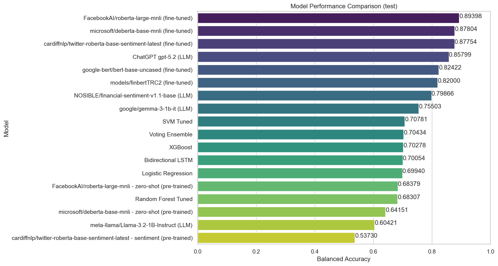

# [MDC-020/INF-0619] Final Project - Team Overflow

This project is part of the [Mineração de Dados Complexos (MDC)](https://www.ic.unicamp.br/~mdc/) (website in PTBR) extension course at Unicamp (INF-0619 - Data@Work/Final Project).

## Team

### Team Overflow

- Arthur Jardim Rodrigues Mochon
- Bruno Alexandre Rosa
- Felipe Galileu Martins
- Jonathas Antunes Batista
- Nickolas Souza Voss
- Rafael Hummel Santos

## Project Description

This project implements a comprehensive financial sentiment analysis system for classifying financial news and text into three sentiment categories: **neutral**, **positive**, and **negative**. The project explores multiple machine learning approaches, including classical ML models, deep learning architectures (LSTM), transformer-based models, and large language models (LLMs).

The main goal is to develop and compare different approaches for financial sentiment classification, evaluating their performance on a standardized dataset and generating predictions for submission to [Kaggle competition: Análise de Sentimento de Notícias de Finanças](https://www.kaggle.com/competitions/analise-de-sentimento-de-noticias-de-financas).

## Quick Start

### Prerequisites

- Python 3.x - recomended 3.12
- pip package manager

### Setup Instructions

1. **Create and activate virtual environment:**

```bash
python3 -m venv .venv
source .venv/bin/activate
```

2. **Install dependencies:**

```bash
pip install -r requirements.txt
```

## Usage

### Running the Main Notebook

1. Open notebook (multiple options)
   1. Use your preferred IDE (VSCode, PyCharm etc)
   2. Start Jupyter Notebook or JupyterLab:

      ```bash
      jupyter notebook
      # or
      jupyter lab
      ```

   3. Open in Google Colab

2. Open `INF0619_Final_Project.ipynb` and execute the cells sequentially.

3. The notebook will:
   - Load and preprocess the data
   - Train or load pre-trained models
   - Evaluate models on the validation set
   - Generate predictions for the test set
   - Create submission files in the `submissions/` directory

### Model Types

The project includes implementations of several model architectures:

- **Classical Machine Learning Models** (`src/models/classical.py`):

  - Logistic Regression
  - Random Forest
  - Support Vector Machine (SVM)
  - XGBoost
  - Voting Classifier (ensemble)

- **Deep Learning Models** (`src/models/lstm.py`):

  - LSTM (Long Short-Term Memory) networks with word embeddings

- **Transformer Models** (`src/models/transformers.py`):

  - Fine-tuned transformer models (e.g., FinBERT, BERT)
  - Zero-shot classification using pre-trained models

- **Large Language Models** (`src/models/llm.py`):
  - OpenAI GPT
  - Local LLM models

### Model Training vs. Loading

- **Training from scratch:** If the `models/` directory is empty or doesn't contain a specific model, the notebook will train it from scratch. This process may take significant time depending on the model type.

- **Loading pre-trained models:** If pre-trained models are available in the `models/` directory, they will be automatically loaded, skipping the training phase.

### Submission Files

After running the notebook, submission files will be generated in the `submissions/` directory. These CSV files are formatted for [Kaggle submission](https://www.kaggle.com/competitions/analise-de-sentimento-de-noticias-de-financas) and contain predictions for the test set. Each model type may generate its own submission file.

## Models

The project supports multiple model architectures for financial sentiment analysis:

- **Classical ML Models:** Fast training and inference, good baseline performance
- **LSTM Models:** Capture sequential patterns in text
- **Transformer Models:** State-of-the-art performance, fine-tuned on financial domain
- **LLM Models:** Leverage large pre-trained language models for zero-shot learning

Each model type has different strengths and computational requirements. The notebook includes evaluation metrics (balanced accuracy, confusion matrices) to compare their performance.

## Results

The following figure shows the test results comparing different models:


